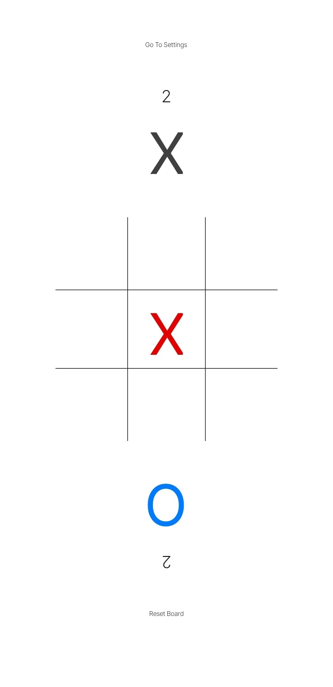
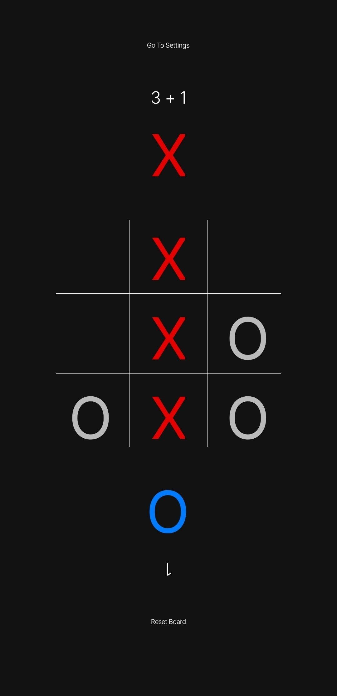
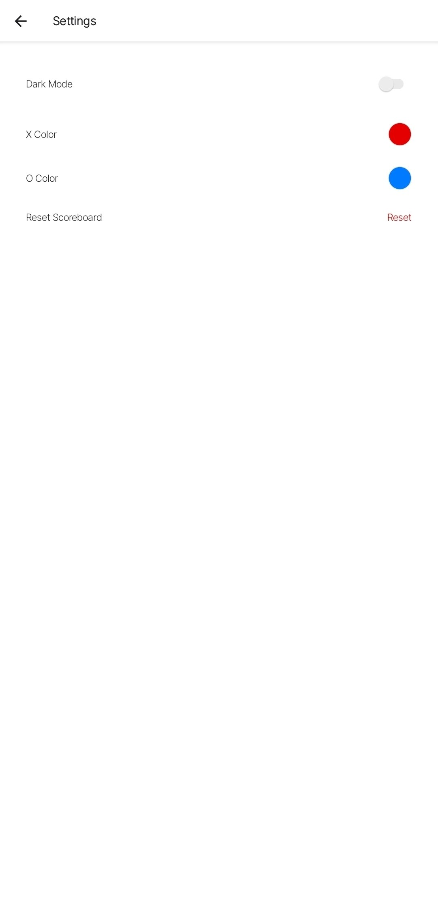
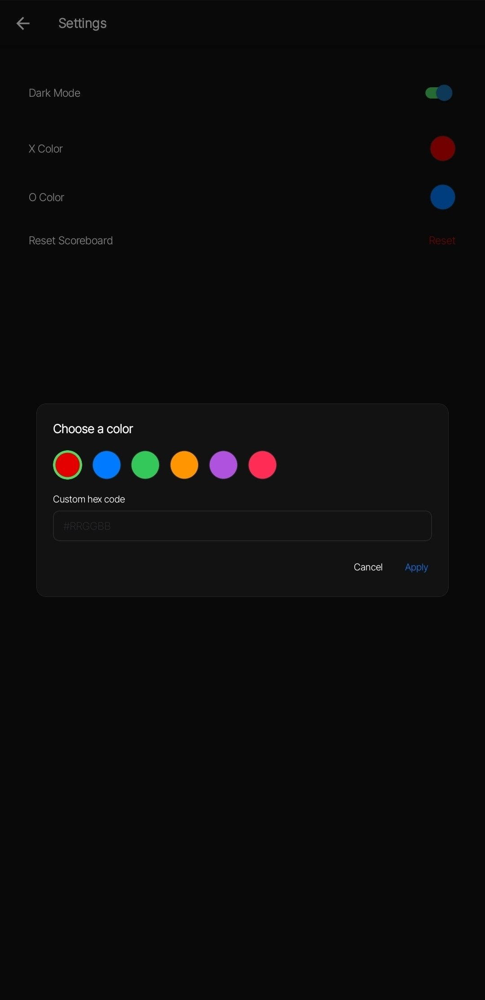

# rn-tic-tac-toe

A local two-player tic-tac-toe game built with [Expo](https://expo.dev) and React Native. Play a full game with win/tie detection, a persistent scoreboard, and a settings screen for dark mode and custom X/O colors.

## Installation & run instructions

1. Install dependencies

   ```bash
   npm install
   ```

2. Start the app

   ```bash
   npx expo start
   ```

3. In the output, choose how to open it:

   - [development build](https://docs.expo.dev/develop/development-builds/introduction/)
   - `npm run android` for an Android emulator
   - `npm run ios` for an iOS simulator
   - `npm run web` for the browser
   - [Expo Go](https://expo.dev/go), a limited sandbox for trying out app development with Expo

## Features

- Two-player tic-tac-toe, played locally on one device, with win and tie detection across rows, columns, and diagonals.
- A scoreboard that persists across app restarts, so X/O win counts survive a relaunch.
- Confirmation prompts before anything gets reset: tapping the board mid-game, or the "Reset Scoreboard" button in Settings, asks first.
- A dark mode toggle in Settings. The status bar icon color follows it, instead of just the OS setting.
- Custom X/O piece colors: pick from a preset palette, or type a hex code, from a color picker modal in Settings.

## Screenshots

| Home, light mode | Home, dark mode (win) |
| --- | --- |
|  |  |

| Settings | Color picker |
| --- | --- |
|  |  |

## Technologies used

- React Native 0.86 and React 19
- Expo SDK 57
- Expo Router for file-based navigation
- React Navigation, underneath Expo Router's native stack
- expo-status-bar, for the theme-aware status bar
- @react-native-async-storage/async-storage, for persisting scores and settings
- TypeScript

## Known issues / future improvements

- Only the standard 3x3 board is supported; there's no board-size or win-condition option.
- No play against bot / single-player mode. Both players need to be on the same device.
- The custom hex color field doesn't preview the color before you apply it.
- No animation when a piece is placed, or when a game ends in a win or tie.
